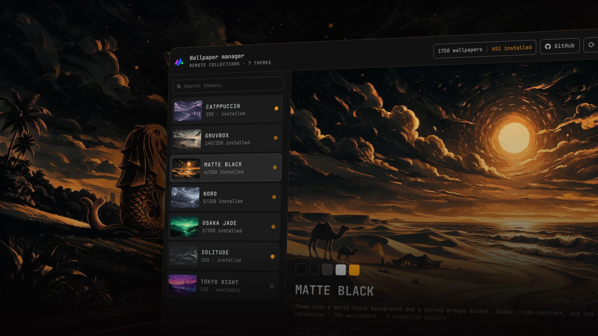
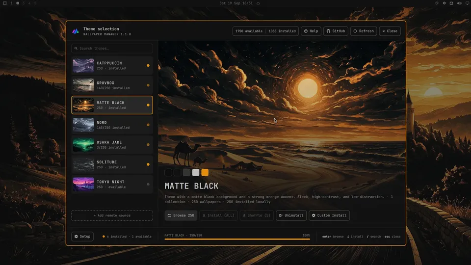
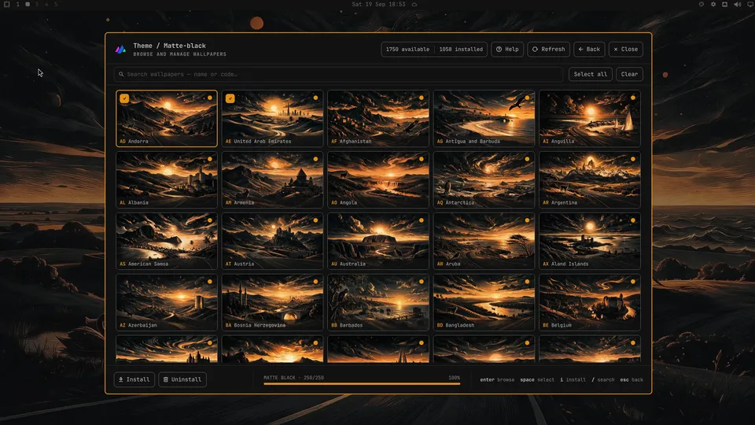
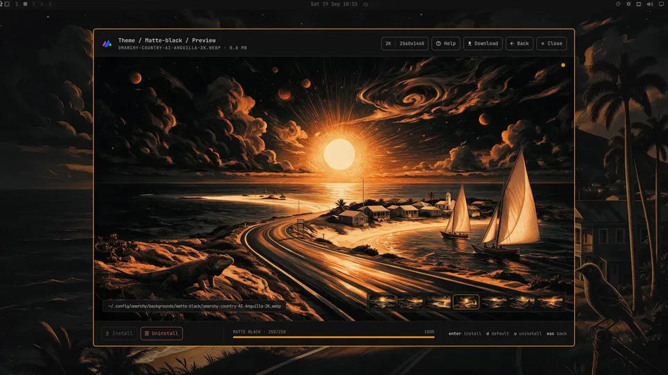
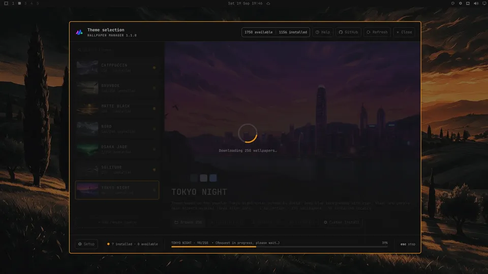
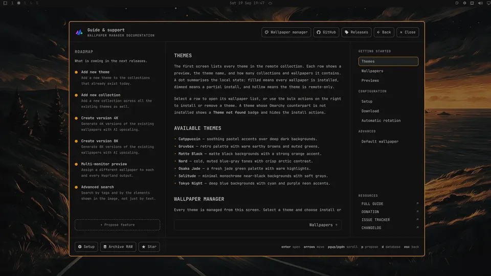
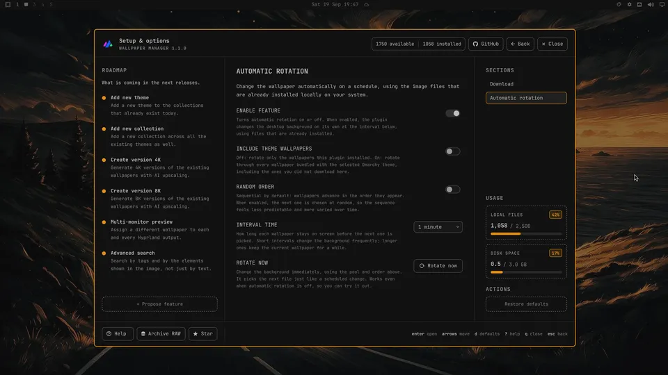

# Omarchy Wallpapers Plugin



An [Omarchy](https://github.com/omacom/omarchy) shell plugin to browse, preview,
install and manage the wallpaper collection, theme by theme, straight from the
bar: pick a collection, leaf through every wallpaper full screen, install or
remove single images or whole themes, and set your next background without ever
leaving the desktop.

https://github.com/emkcloud/omarchy-wallpapers

The plugin (`emkcloud.wallpaper-manager`) talks to a versioned snapshot served
from a CloudFront CDN, so it keeps working offline once the catalogue is cached,
and installs wallpapers natively into the active Omarchy theme.

## Features

- **Theme browser** — master/detail screen: theme preview, palette, description
  and install counts.
- **Wallpaper grid** — lazy thumbnails, search, installed/default state per
  tile.
- **Fullscreen preview** — hi-res image, thumbnail filmstrip, install/uninstall,
  set-as-default.
- **Bulk operations** — install a whole theme, uninstall it, or install a random
  sample of wallpapers.
- **Live progress** — the footer bar and the list keep counting while an
  operation runs.
- **Search** — a small search engine to filter themes and wallpapers.
- **Automatic rotation** — cycle the current theme's wallpapers on a schedule.
- **Theme-aware UI** — colors, borders and rounding follow the active Omarchy
  theme.

## Requirements

- Omarchy Linux `0.4.0` or newer (Quickshell).
- Packages: `curl` and `jq` (installed by default in Omarchy).
- The Omarchy wallpaper tools shipped with the desktop.

## Installation

The repository root is the plugin, so install it from git:

```bash
omarchy plugin add https://github.com/emkcloud/omarchy-wallpapers-plugin.git --enable --yes
```

Summon it from the CLI too:

```bash
omarchy-shell shell summon emkcloud.wallpaper-manager '{}'
```

Update to the latest snapshot with:

```bash
omarchy plugin update emkcloud.wallpaper-manager --yes
```

## Screenshots

<table>
  <tr>
    <td><a href="assets/images/screenshots/theme-selection-2k.webp"></a></td>
    <td><a href="assets/images/screenshots/wallpapers-2k.webp"></a></td>
    <td><a href="assets/images/screenshots/preview-2k.webp"></a></td>
  </tr>
  <tr>
    <td><a href="assets/images/screenshots/downloading-2k.webp"></a></td>
    <td><a href="assets/images/screenshots/help-2k.webp"></a></td>
    <td><a href="assets/images/screenshots/settings-2k.webp"></a></td>
  </tr>
</table>

## Removal

Remove the plugin the same way as any other Omarchy plugin:

```bash
omarchy plugin remove emkcloud.wallpaper-manager
```

This disables the plugin and deletes its git checkout. It does **not** touch
your wallpapers or the runtime caches, so cleanup is entirely opt-in and left to
you:

- **Installed wallpapers** live in `~/.config/omarchy/backgrounds/<theme>/`.
  Remove only the ones you installed, or the whole folder of a theme you no
  longer want.
- **Runtime caches** (catalogue and images) live in
  `~/.cache/omarchy/emkcloud.wallpaper-manager/`. Deleting the folder is safe;
  it is rebuilt on the next run.
- If one of the wallpapers is your **current background**, reset it to the
  theme default before deleting it, otherwise the desktop keeps pointing at a
  missing file.

The plugin never modifies your configuration without an explicit action, and
removal is always available.

## How it works

The QML overlay is a thin controller; all the heavy lifting is done by
`scripts/manager.sh` (bash + `curl` + `jq` + `sha256`). The script prints
tab-separated records on stdout that the QML parses into list models.

- **Data** — `datasets.json` lists the themes; each theme has a `catalog.json`
  with its wallpapers.
- **Install / Remove** — files are downloaded atomically and verified with
  `sha256`.
- **Set default** — downloads the file first if needed, then calls
  `omarchy-theme-bg-set`.
- **Versioned CDN snapshot** — wallpapers come from a versioned CloudFront base,
  so a snapshot never changes under the user's feet.
- **Caches** — the dataset and the big images are stored in
  `~/.cache/omarchy/<plugin-id>/`.

## Automatic rotation

The plugin can change the background on its own, so a theme stays fresh without
touching it by hand. Everything is configured in **Setup → Automatic rotation**:

- **Enable feature** — turn the timer on or off.
- **Interval time** — how long each wallpaper stays up before the next one (1,
  5, 15, 30, 60 or 120 minutes).
- **Include theme wallpapers** — off rotates only the wallpapers you installed
  from the collection.
- **Random order** — sequential by name, or pick at random (never the one already
  on screen).
- **Rotate now** — change the background immediately with the settings above,
  even when the timer is off.

Rotation follows the **current Omarchy theme**, so switching theme switches the
pool. It only uses files already on disk — nothing is downloaded — and it keeps
running with the overlay closed, from shell start to shell restart. Turning the
switch off leaves the current wallpaper in place.

## Showcase

<table>
  <tr>
    <td><a href="https://github.com/emkcloud/omarchy-wallpapers/blob/main/images/tokyo-night/countries/omarchy-country-BH-Bahrain-2K.webp"></a></td>
    <td><a href="https://github.com/emkcloud/omarchy-wallpapers/blob/main/images/tokyo-night/countries/omarchy-country-HK-Hong-Kong-2K.webp"></a></td>
    <td><a href="https://github.com/emkcloud/omarchy-wallpapers/blob/main/images/tokyo-night/countries/omarchy-country-BT-Bhutan-2K.webp"></a></td>
  </tr>
  <tr>
    <td><a href="https://github.com/emkcloud/omarchy-wallpapers/blob/main/images/osaka-jade/countries/omarchy-country-BA-Bosnia-Herzegovina-2K.webp"></a></td>
    <td><a href="https://github.com/emkcloud/omarchy-wallpapers/blob/main/images/osaka-jade/countries/omarchy-country-FI-Finland-2K.webp"></a></td>
    <td><a href="https://github.com/emkcloud/omarchy-wallpapers/blob/main/images/osaka-jade/countries/omarchy-country-VU-Vanuatu-2K.webp"></a></td>
  </tr>
  <tr>
    <td><a href="https://github.com/emkcloud/omarchy-wallpapers/blob/main/images/matte-black/countries/omarchy-country-VA-Vatican-2K.webp"></a></td>
    <td><a href="https://github.com/emkcloud/omarchy-wallpapers/blob/main/images/matte-black/countries/omarchy-country-VI-US-Virgin-Islands-2K.webp"></a></td>
    <td><a href="https://github.com/emkcloud/omarchy-wallpapers/blob/main/images/matte-black/countries/omarchy-country-TD-Chad-2K.webp"></a></td>
  </tr>
  <tr>
    <td><a href="https://github.com/emkcloud/omarchy-wallpapers/blob/main/images/gruvbox/countries/omarchy-country-AE-United-Arab-Emirates-2K.webp"></a></td>
    <td><a href="https://github.com/emkcloud/omarchy-wallpapers/blob/main/images/gruvbox/countries/omarchy-country-VA-Vatican-2K.webp"></a></td>
    <td><a href="https://github.com/emkcloud/omarchy-wallpapers/blob/main/images/gruvbox/countries/omarchy-country-TT-Trinidad-and-Tobago-2K.webp"></a></td>
  </tr>
</table>

## Security

Only image files are accepted at install time: a catalogue entry whose extension
is not in the allowlist (`webp`, `jpg`, `jpeg`, `png`) is skipped, so a malformed
or malicious entry cannot drop a non-image into the wallpaper folder. Every
download is also pinned to the `sha256` recorded in the catalogue and discarded
if it does not match. Installed wallpapers live in
`~/.config/omarchy/backgrounds/<theme>/`.

## License

This project is licensed under the [MIT License](LICENSE).
